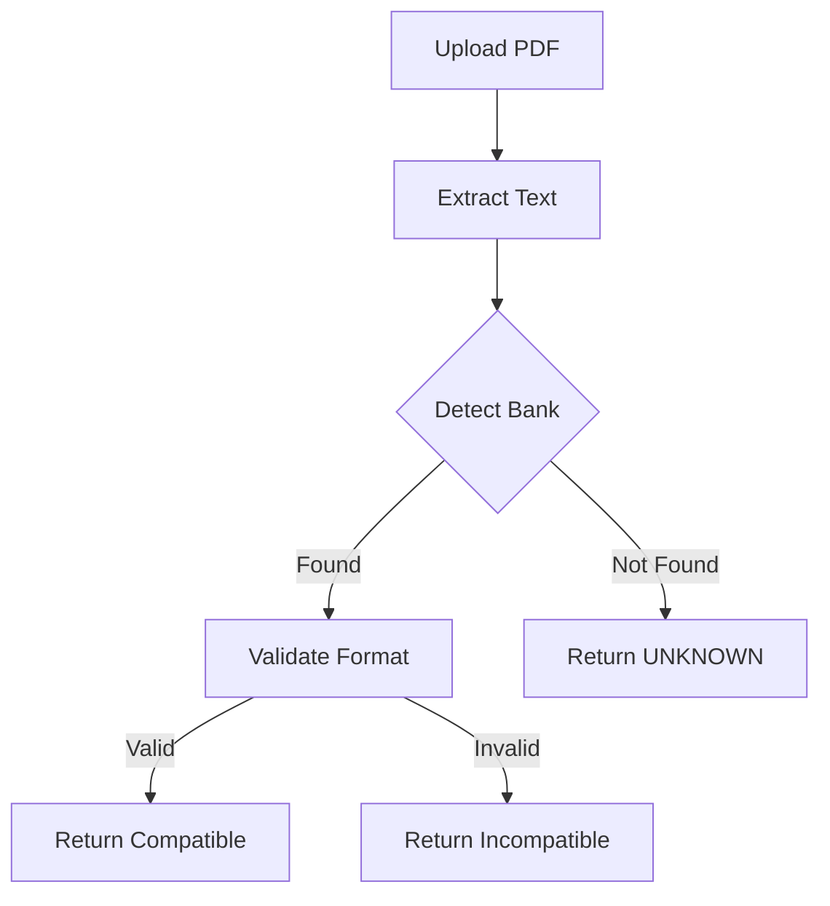

# 🏦 Système de Validation Automatique des Relevés Bancaires

Système complet de détection et validation des relevés bancaires pour ComptaFlow.

## 🎯 Fonctionnalités

✅ **Détection automatique** de la banque (LCL, Crédit Agricole, Banque Populaire)  
✅ **Validation du format** avant conversion  
✅ **Estimation du nombre de transactions**  
✅ **Interface utilisateur** intuitive  
✅ **Système de signalement** pour les banques non supportées  
✅ **Tests unitaires** inclus  

## 📦 Fichiers fournis

| Fichier | Type | Description |
|---------|------|-------------|
| `bank_detector.py` | Backend | Module Python de détection et validation |
| `backend_validation_endpoints.py` | Backend | Endpoints FastAPI à intégrer |
| `StatementValidator.jsx` | Frontend | Composant React de validation |
| `test_bank_detector.py` | Tests | Tests unitaires |
| `INSTALLATION_GUIDE.md` | Doc | Guide d'installation complet |
| `requirements_validation.txt` | Config | Dépendances Python |

## 🚀 Installation rapide

### Backend (5 minutes)

```bash
# 1. Installer PyPDF2
pip install PyPDF2

# 2. Copier bank_detector.py dans le dossier backend
cp bank_detector.py /path/to/backend/

# 3. Ajouter le code des endpoints dans backend-main.py
# (voir backend_validation_endpoints.py)

# 4. Redéployer
git add . && git commit -m "Add validation system" && git push
```

### Frontend (3 minutes)

```bash
# 1. Copier le composant
cp StatementValidator.jsx /path/to/frontend/src/components/

# 2. Ajouter la route dans App.jsx
# <Route path="/validate" element={<StatementValidator />} />

# 3. Redéployer
git add . && git commit -m "Add validator UI" && git push
```

## 🔬 Tests

```bash
# Lancer les tests unitaires
python test_bank_detector.py
```

Résultat attendu :
```
✅ Test LCL detection passed
✅ Test CA detection passed
✅ Test BP detection passed
✅ Test unknown bank passed
✅ ALL TESTS PASSED!
```

## 📊 Banques supportées

| Banque | Code | Formats détectés |
|--------|------|------------------|
| LCL | `LCL` | DATE • LIBELLE • DEBIT • CREDIT |
| Crédit Agricole | `CREDIT_AGRICOLE` | Date achat • Commerce • Montant |
| Banque Populaire | `BANQUE_POPULAIRE` | DATE • COMMERCANT • MONTANT |

## 🛠️ Architecture

```
┌─────────────────┐
│   Frontend      │
│  (React/Vite)   │
│                 │
│ StatementValidator
│                 │
└────────┬────────┘
         │ POST /validate-statement
         ▼
┌─────────────────┐
│   Backend       │
│  (FastAPI)      │
│                 │
│ bank_detector.py│
│                 │
└─────────────────┘
```

## 🔍 Flow de validation



## 📈 Métriques

Le système retourne :
- ✅ **Compatible** : Oui/Non
- 🏦 **Banque** : LCL, CA, BP, ou UNKNOWN
- 📊 **Transactions estimées** : Nombre
- 📋 **Colonnes détectées** : Liste
- ⚠️ **Colonnes manquantes** : Liste

## 🎨 Interface utilisateur

### Zone d'upload
```
┌────────────────────────────────┐
│   📤 Choisir un fichier PDF     │
│   ✅ releve-lcl-sept.pdf        │
└────────────────────────────────┘
  [Vérifier la compatibilité]
```

### Résultat compatible
```
✅ Relevé compatible !
🏦 Banque détectée : LCL - Crédit Lyonnais
📊 Environ 45 transactions détectées
```

### Résultat incompatible
```
❌ Relevé non compatible
⚠️  Banque non reconnue
[Signaler ma banque]
```

## 🔧 Personnalisation

### Ajouter une nouvelle banque

Dans `bank_detector.py`, ajoutez :

```python
BANK_SIGNATURES['NOUVELLE_BANQUE'] = {
    'keywords': ['NOM BANQUE', 'site-web.fr'],
    'date_patterns': [r'\d{2}/\d{2}/\d{4}'],
    'amount_pattern': r'\d+,\d{2}',
    'columns': ['Date', 'Libellé', 'Montant'],
    'description': 'Nom complet de la banque'
}
```

## 📞 Endpoints API

### POST /validate-statement
```json
Request: FormData with PDF file
Response: {
  "compatible": true,
  "bank": "LCL",
  "bank_description": "LCL - Crédit Lyonnais",
  "message": "✅ Relevé compatible",
  "estimated_transactions": 45,
  "details": {...}
}
```

### GET /supported-banks
```json
Response: {
  "count": 3,
  "banks": {
    "LCL": "LCL - Crédit Lyonnais",
    "CREDIT_AGRICOLE": "Crédit Agricole",
    "BANQUE_POPULAIRE": "Banque Populaire"
  }
}
```

### POST /report-unsupported
```json
Request: { "bank_name": "Ma Banque" }
Response: { "success": true, "message": "..." }
```

## 🐛 Dépannage

| Problème | Solution |
|----------|----------|
| Module not found | Vérifier que `bank_detector.py` est au bon endroit |
| PyPDF2 error | `pip install PyPDF2` |
| 404 endpoint | Vérifier que le backend est redéployé |
| Composant vide | Vérifier la route dans App.jsx |

## 📚 Documentation

- **Guide d'installation** : INSTALLATION_GUIDE.md
- **Code backend** : backend_validation_endpoints.py
- **Tests** : test_bank_detector.py

## 🎯 Roadmap

- [x] Support LCL, CA, BP
- [ ] Support Société Générale
- [ ] Support BNP Paribas
- [ ] Support CIC
- [ ] API de feedback utilisateur
- [ ] Dashboard admin des statistiques

## 📄 Licence

Propriétaire - ComptaFlow © 2025

---

**Développé avec ❤️ pour ComptaFlow**
